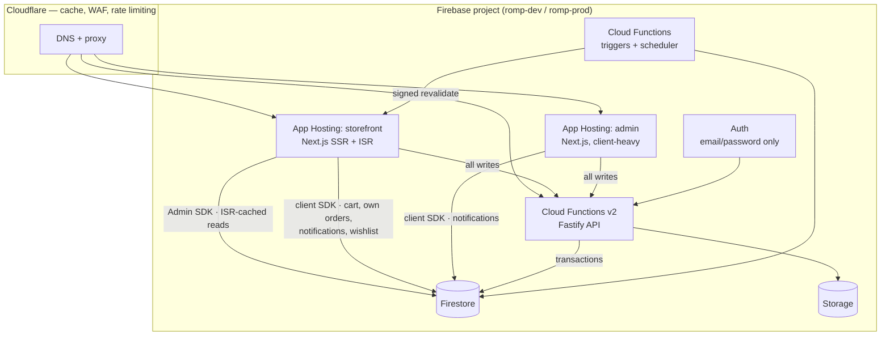
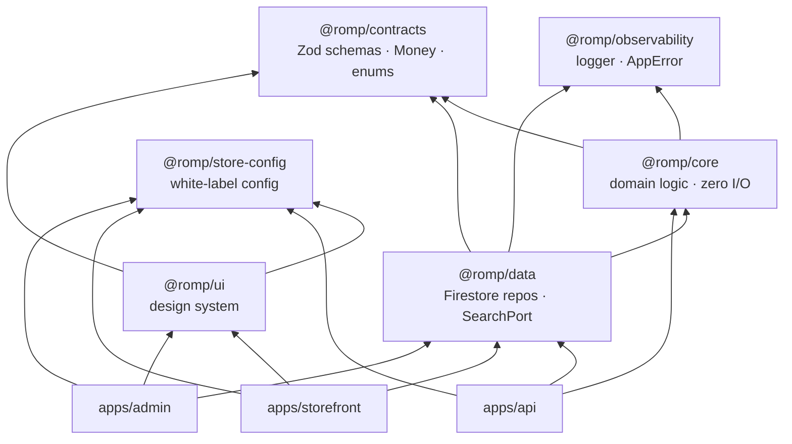
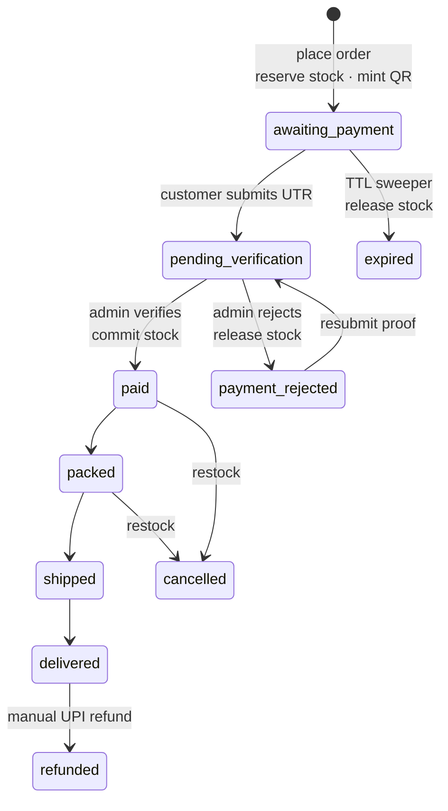
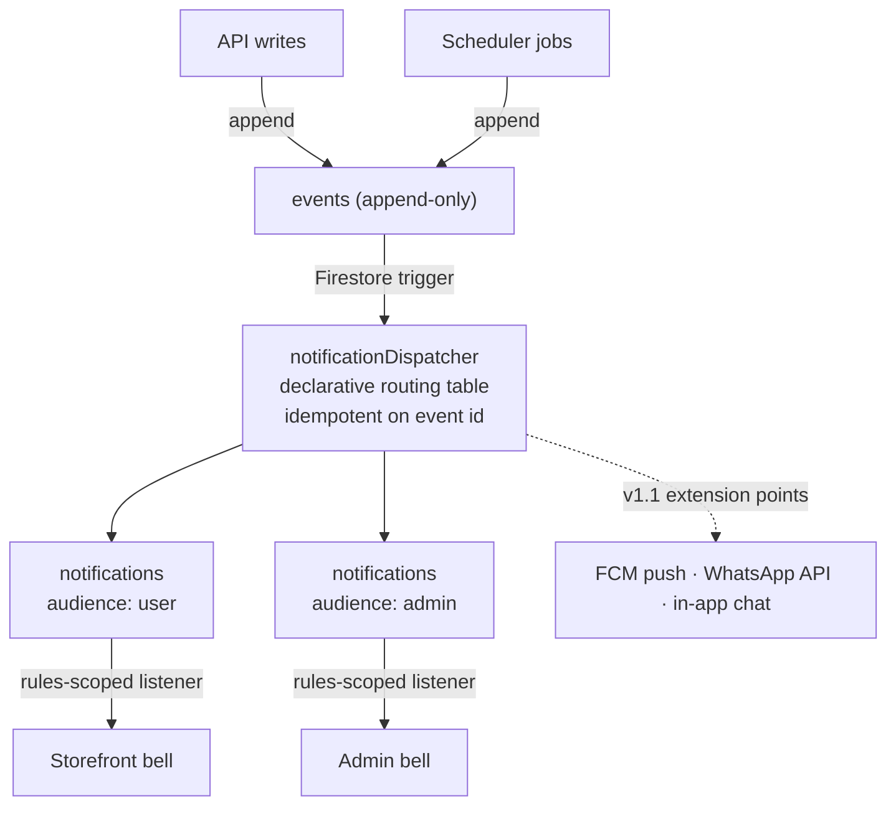

# Architecture

**Status:** current as of Phase 0.
**Audience:** anyone changing the system. Read this before designing a feature.

---

## 1. Shape of the system

Three deployable surfaces per store, one Firebase project per store per environment.



### Why hybrid rather than one or the other

A pure-Next.js system would put order placement in a route handler — workable, but async work
(reservation expiry, notification fan-out, media processing, analytics rollups) has no natural home,
and a mobile client later would have no API to call.

A pure separate-API system would force every product page through an HTTP hop before rendering,
costing latency on exactly the pages that must be fast and indexable.

So: **reads that are public and cacheable render on the server directly against Firestore; every
write goes through the Functions API; everything asynchronous is a trigger or a scheduled job.**

See [ADR-0001](adr/0001-hybrid-backend.md).

---

## 2. Read/write split

This table is the contract. Deviating from it is a design change, not an implementation detail.

| Data                           | Read path                                      | Write path                                        | Why                                                       |
| ------------------------------ | ---------------------------------------------- | ------------------------------------------------- | --------------------------------------------------------- |
| Products, variants, categories | Server, Admin SDK, ISR-cached, tag-revalidated | API (admin only)                                  | Public and cacheable; needs to be fast and indexable      |
| Inventory                      | Server (for stock badges)                      | API only, in transactions                         | Overselling is unacceptable; clients must never touch it  |
| Cart                           | Client SDK, owner-scoped                       | API only (`POST /v1/cart/items`)                  | Live reactivity; but pricing must be server-authoritative |
| Own orders                     | Client SDK, owner-scoped                       | API only                                          | Customer watches status change during verification        |
| Notifications                  | Client SDK, audience-scoped                    | API/Functions write; client may set `readAt` only | Real-time bell without polling                            |
| Wishlist                       | Client SDK, owner-scoped                       | API only                                          | Instant heart toggle across tabs                          |
| Reviews                        | Server (published only)                        | API only                                          | Moderated content                                         |
| Everything else                | —                                              | API/Functions only                                | —                                                         |

**Security rules deny all client writes** to `products`, `variants`, `inventory`, `inventoryLedger`,
`reservations`, `orders`, `refunds`, `events`, `settings`, `counters`, `identityIndex`, `warehouses`,
`analytics`. Rules are the enforcement; the table above is the intent.

The one narrow exception: a client may update a notification's `readAt` and nothing else, expressed
in rules as

```
request.resource.data.diff(resource.data).affectedKeys().hasOnly(['readAt'])
```

---

## 3. Package boundaries



Rules that keep this honest:

- **`@romp/core` may not import `firebase-admin`, `firebase`, or `@romp/data`.** Domain logic is
  pure: pricing, the order state machine, the notification routing table, identity normalisation.
  It runs in a unit test in milliseconds with no emulator.
- **`@romp/contracts` is the only place types are defined.** Everything else imports them. This is
  what makes the API contract and the Firestore converters provably the same shape.
- **`@romp/data` owns every Firestore query.** No app constructs a query directly; that is what makes
  the Typesense swap ([ADR-0002](adr/0002-firestore-search-port.md)) a contained change. Enforced by
  `no-restricted-imports` in `createAppConfig` rather than by review: an app importing
  `firebase-admin/firestore` fails lint with a message naming what it bypasses.
- **Repositories take a `StoreContext`.** Single-tenant today; this is the seam that makes adding
  `tenantId` mechanical rather than a rewrite ([ADR-0005](adr/0005-single-tenant-white-label.md)).
- **Repositories take the caller explicitly, and it is not optional.** The Admin SDK bypasses security
  rules, so `infra/firestore.rules` protects nothing in this layer — ownership filtering here is the
  only control, not a second one. Ambient identity is how that fails: a method reading the caller from
  request-scoped state compiles and runs whether or not anyone set it, so a background job reads with
  whatever was left behind. A resource the caller does not own yields **404, not 403**.

---

## 4. Order lifecycle

Payment status and fulfilment status are **separate fields**. Conflating them is how order systems
become unfixable — a paid order can be on hold, a delivered order can be refunded.



The money-critical invariant: **stock moves `available → reserved → committed`, and every
transition is one Firestore transaction that also appends an audit event.** A reservation that is
never resolved is released by the sweeper; there is no state in which stock is held with nothing
accounting for it.

---

## 5. Notification pipeline

With no email, this pipeline is the _only_ push channel to customers. Its liveness is a
customer-facing concern, which is why dispatcher backlog is an alerting condition.



Because notifications are _derived_ from the `events` spine and keyed by event id, a dispatcher
outage is recoverable by replay without duplicating anything. Order status is also always readable
directly on the account page, so a stalled dispatcher degrades the experience without hiding truth.

Details: [`NOTIFICATIONS.md`](NOTIFICATIONS.md), [ADR-0007](adr/0007-notifications-not-email.md).

---

## 6. Caching and revalidation

| Surface                 | Strategy                                                                       |
| ----------------------- | ------------------------------------------------------------------------------ |
| Home                    | ISR, `revalidate = 3600`, rails tagged `catalogue` / `categories`              |
| Category / age listings | ISR per URL; the query string (sort, filters, cursor) is part of the cache key |
| PDP                     | ISR, `getProduct` tagged `product:{slug}` and `catalogue`                      |
| Account, cart, checkout | Dynamic, never cached                                                          |
| Admin                   | Fully dynamic, `no-store`                                                      |

**The tag vocabulary is a single module**, `apps/storefront/src/server/tags.ts`, imported by both
the reads that tag a fetch and the writes that revalidate. It is pure — no Firebase import — so a
Cloud Function can import the same `cacheTags` it will bust. The tags are `catalogue` (store-wide),
`categories` (the tree), `product:{slug}`, `category:{slug}` and `age:{value}`, and `tagsForProduct()`
returns the full set one product edit invalidates. Keeping them in one place is not tidiness: a read
tagging `product:wooden-blocks` while a write revalidates `products:wooden-blocks` does not error, it
just serves a stale page forever — the worst kind of caching bug, because the code looks correct.

**Reads degrade at build time.** `next build` runs with no datastore in CI and locally, and every
catalogue page reads Firestore, so a read short-circuits to empty when no project is reachable
(`catalogueAvailable()`). The page prerenders a shell and ISR fills it from live data on the first
request. This is why the home page is `○ (Static)` in the build output despite reading a database:
generation is deferred, not skipped.

Writes do not wait on cache invalidation. An admin write commits, appends an event, and a Function
calls `revalidateTag` with the tags from `tagsForProduct()` (Task 12). Revalidation failure is logged
and retried; it never fails the write. The hourly `revalidate` floor is the backstop if a
revalidation is ever missed.

At the edge, Cloudflare caches `/_next/static` and optimised images aggressively, and **bypasses**
`/api/*` and the entire admin hostname. Product media is a Storage object _path_ joined onto
`NEXT_PUBLIC_MEDIA_BASE_URL` at render time — never a stored download URL, whose embedded token
rotates on replace and would break the link on the next upload (ADR-0003, `DATA_MODEL.md`).

**Structured data and per-page SEO.** The product page emits schema.org `Product` + `Offer` JSON-LD,
built by `apps/storefront/src/lib/structured-data.ts` from the same `ProductDoc` and variant data the
page renders — so the rich result cannot advertise a price the page does not show. `availability` is
a schema.org URL derived from the same in-stock boolean the buy box uses, never a count, and the
price is the product's "from" minimum in major units. Each product sets its own canonical URL, its
`robots` directive from `seo.index` (a per-product control, defaulting nowhere), and an OG image
resolved from its cover media, falling back to the store's OG artwork when no media host is
configured. The PDP is **not** pre-rendered with `generateStaticParams`: doing so would couple the
build to a populated database (which CI does not have) and would not scale with the catalogue, and
on-demand ISR yields the same cached HTML without either cost — the first visitor to a product pays
one render.

---

## 7. Deployment topology

| Environment | Firebase project | Domains                                               | Deploy trigger             |
| ----------- | ---------------- | ----------------------------------------------------- | -------------------------- |
| dev         | `romp-dev`       | `*.web.app` defaults                                  | merge to `main`            |
| prod        | `romp-prod`      | `example.com`, `admin.example.com`, `api.example.com` | tag `v*` + manual approval |

Region `asia-south1` throughout — the customer base is Indian, and Firestore location is immutable
after creation.

DNS lives at Cloudflare (nameservers delegated from GoDaddy). **Firebase domain verification must
complete with the proxy grey-clouded before proxying is enabled**, then SSL mode must be Full
(strict). Reversing that order breaks certificate issuance; see
[ADR-0003](adr/0003-cloudflare-fronting-firebase.md).

Secrets live in Secret Manager, surfaced to Functions and App Hosting as bound secrets, and to CI
through GitHub Environments. Nothing secret is ever committed, including in `.env.example`.

---

## 8. Testing strategy

| Layer                | Tool                                                        | Scope                                                                   |
| -------------------- | ----------------------------------------------------------- | ----------------------------------------------------------------------- |
| Domain               | Vitest, no emulator                                         | Pricing, `Money`, state machines, routing table, identity normalisation |
| Repositories & rules | Vitest + Firestore emulator, `@firebase/rules-unit-testing` | Query shapes, transactions, every rules denial                          |
| API                  | Vitest + emulator                                           | Route contracts, auth guards, idempotency, problem+json shapes          |
| Components           | Vitest + Testing Library + `vitest-axe`                     | Rendering, accessibility, reduced-motion                                |
| Flows                | Playwright on preview channels                              | Purchase path smoke                                                     |
| Budgets              | Lighthouse CI                                               | LCP / CLS / TBT regressions fail the build                              |

Concurrency is tested explicitly, not assumed: N parallel orders against one remaining unit must
yield exactly one success.

---

## 9. Known risks

| Risk                                                                                             | Mitigation                                                                                                                                                          | Owner doc                                                                         |
| ------------------------------------------------------------------------------------------------ | ------------------------------------------------------------------------------------------------------------------------------------------------------------------- | --------------------------------------------------------------------------------- |
| Mobile-only users cannot self-serve password reset (no email, no OTP)                            | Admin-assisted reset via WhatsApp with single-use short-TTL links; WhatsApp Business API OTP in v1.1                                                                | [ADR-0006](adr/0006-password-identity-without-otp.md), [IDENTITY.md](IDENTITY.md) |
| No email → notifications are the only push channel; a stalled dispatcher is silent customer harm | Dispatcher-backlog alert, idempotent replay from `events`, order status always readable on the account page                                                         | [ADR-0007](adr/0007-notifications-not-email.md)                                   |
| Alias-based mobile identity is non-standard                                                      | Isolated in one pure, exhaustively tested function; Auth records carry the real `phoneNumber`, so migrating to a real phone provider preserves data                 | [IDENTITY.md](IDENTITY.md)                                                        |
| Cloudflare proxy breaks Firebase certificate issuance                                            | Verify grey-clouded, then proxy with SSL Full (strict)                                                                                                              | [ADR-0003](adr/0003-cloudflare-fronting-firebase.md)                              |
| Firestore filter matrix outgrows composite indexes                                               | `SearchPort` isolates it; Typesense adapter is a contained change                                                                                                   | [ADR-0002](adr/0002-firestore-search-port.md)                                     |
| Manual UPI verification is an ops bottleneck and a fraud surface                                 | Amount + order note encoded in the QR makes reconciliation mechanical; global UTR uniqueness; immutable audit events; queue-depth alert; CSV reconciliation in v1.1 | [RUNBOOKS.md](RUNBOOKS.md)                                                        |
| Sweeper fails silently → stock leaks                                                             | Alert on **non-execution**, not merely on failure; reconciliation runbook                                                                                           | [RUNBOOKS.md](RUNBOOKS.md)                                                        |
| White-label config rot — branding creeping back into code                                        | `no-hardcoded-brand` ESLint rule; CI builds two store configs                                                                                                       | [WHITE_LABEL.md](WHITE_LABEL.md)                                                  |
| Firestore has no full-text search                                                                | Accepted for v1.0: constrained filters + prefix match; Typesense in v1.1                                                                                            | [ADR-0002](adr/0002-firestore-search-port.md)                                     |

---

## 10. Decision log

| ADR                                               | Decision                                             |
| ------------------------------------------------- | ---------------------------------------------------- |
| [0001](adr/0001-hybrid-backend.md)                | Hybrid backend: Next.js reads, Functions writes      |
| [0002](adr/0002-firestore-search-port.md)         | Firestore search behind a swappable `SearchPort`     |
| [0003](adr/0003-cloudflare-fronting-firebase.md)  | Cloudflare proxies Firebase App Hosting              |
| [0004](adr/0004-money-in-minor-units.md)          | All money is integer minor units                     |
| [0005](adr/0005-single-tenant-white-label.md)     | Single-tenant, config-per-deployment white-labelling |
| [0006](adr/0006-password-identity-without-otp.md) | Email-or-mobile password identity without OTP        |
| [0007](adr/0007-notifications-not-email.md)       | In-app notifications and WhatsApp instead of email   |
