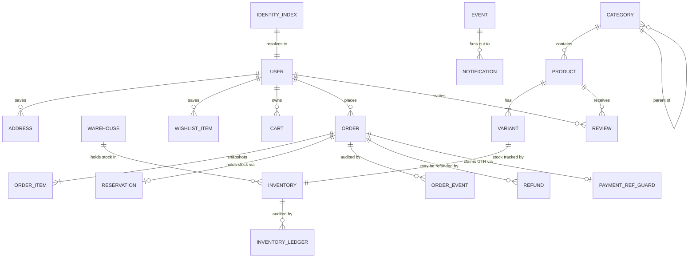

# Data model

Firestore schema for one store (one Firebase project). Every collection, its fields, its indexes and
the invariants that must hold.

**Conventions used throughout**

| Convention      | Rule                                                                                                                                                                                                                                                                                                                          |
| --------------- | ----------------------------------------------------------------------------------------------------------------------------------------------------------------------------------------------------------------------------------------------------------------------------------------------------------------------------- |
| Money           | Integer **paise**, always in a field suffixed `Minor`. Never a float, never a formatted string. [ADR-0004](adr/0004-money-in-minor-units.md)                                                                                                                                                                                  |
| Timestamps      | Firestore `Timestamp`. Field names are past-tense events (`createdAt`, `verifiedAt`) or explicit deadlines (`expiresAt`).                                                                                                                                                                                                     |
| IDs             | Firestore auto-IDs, except where a natural key is required (`identityIndex`, `warehouses`, `settings`, `counters`, `inventory`) — **and except for documents written by `pnpm seed`**, which use natural keys throughout so a re-run is an update rather than a duplicate. See [§ seeded document IDs](#seeded-document-ids). |
| Enums           | Defined once in `@romp/contracts` and reused by converters, API schemas and the UI.                                                                                                                                                                                                                                           |
| Denormalisation | Allowed only where a read path demands it, and only when a Function or transaction maintains it. Every denormalised field notes its owner below.                                                                                                                                                                              |
| Validation      | Every document passes a Zod converter on read and write. A malformed document fails loudly rather than propagating.                                                                                                                                                                                                           |

---

## Entity relationships



---

## Catalogue

### `products/{productId}`

| Field                                     | Type                                | Notes                                                                                                                                                                                                                                                                     |
| ----------------------------------------- | ----------------------------------- | ------------------------------------------------------------------------------------------------------------------------------------------------------------------------------------------------------------------------------------------------------------------------- |
| `slug`                                    | string                              | Unique. URL identity: `/p/{slug}`.                                                                                                                                                                                                                                        |
| `name`                                    | string                              |                                                                                                                                                                                                                                                                           |
| `description`                             | string                              |                                                                                                                                                                                                                                                                           |
| `brand`                                   | string                              | Free text in v1.0; not a separate collection.                                                                                                                                                                                                                             |
| `categoryId`                              | string                              | FK → `categories`.                                                                                                                                                                                                                                                        |
| `categorySlug`                            | string                              | **Denormalised** from `categories` for listing queries. Owner: category-write Function.                                                                                                                                                                                   |
| `ageBand`                                 | string                              | Must be one of the configured band values. Not a hardcoded union.                                                                                                                                                                                                         |
| `status`                                  | `'active' \| 'draft' \| 'archived'` | Only `active` is publicly readable.                                                                                                                                                                                                                                       |
| `badge`                                   | string \| null                      | e.g. "Bestseller". Display only.                                                                                                                                                                                                                                          |
| `priceFromMinor`                          | integer                             | **Denormalised** min price across live variants. Owner: variant transaction.                                                                                                                                                                                              |
| `mrpFromMinor`                            | integer                             | **Denormalised** matching MRP.                                                                                                                                                                                                                                            |
| `variantSummary`                          | array                               | **Denormalised** `{ variantId, name, sku, priceMinor, mrpMinor, active, inStock }` for first paint. Owner: variant transaction. `inStock` is a **boolean, never a count** — `inventory` is staff-only, so a count denormalised onto a public document would hand it back. |
| `media`                                   | array                               | `{ path, alt, width, height, blurhash, order }`. Cover is `order: 0`.                                                                                                                                                                                                     |
| `skills`                                  | string[]                            | "Skills it builds" tags.                                                                                                                                                                                                                                                  |
| `boxItems`                                | string[]                            | "In the box" lines.                                                                                                                                                                                                                                                       |
| `safety`                                  | map                                 | `{ bisCertified, bisCertNo, bisCertExpiry, bpaFree, hasSmallParts }`.                                                                                                                                                                                                     |
| `ratingAvg`                               | number                              | **Denormalised**, 0–5, one decimal. Owner: review-publish Function.                                                                                                                                                                                                       |
| `ratingCount`                             | integer                             | **Denormalised**. Owner: review-publish Function.                                                                                                                                                                                                                         |
| `searchTokens`                            | string[]                            | Lowercased prefix tokens for v1.0 search. Owner: product-write Function.                                                                                                                                                                                                  |
| `seo`                                     | map                                 | `{ title, description, index }`. `title` and `description` are null when they should be derived from the product. No `slug` here — `slug` above **is** the URL identity, and two slugs is a drift source.                                                                 |
| `createdAt` / `updatedAt` / `publishedAt` | Timestamp                           |                                                                                                                                                                                                                                                                           |

**Invariants**

- A product cannot reach `status: 'active'` with zero live variants. Enforced in the API, tested.
- `priceFromMinor`, `mrpFromMinor` and `variantSummary` are written in the _same transaction_ as the
  variant change that caused them. They are never repaired lazily.

### `products/{productId}/variants/{variantId}`

| Field                     | Type      | Notes                                                                                       |
| ------------------------- | --------- | ------------------------------------------------------------------------------------------- |
| `productId`               | string    | The parent, duplicated from the path so a collection-group query result is self-describing. |
| `name`                    | string    | e.g. "6–8 yrs · 240 pcs".                                                                   |
| `sku`                     | string    | Unique across the store.                                                                    |
| `priceMinor` / `mrpMinor` | integer   |                                                                                             |
| `options`                 | map       | e.g. `{ ageBand, finish }`.                                                                 |
| `active`                  | boolean   | `false` hides it from selection but keeps order history valid.                              |
| `weightGrams`             | integer   | For future shipping calculation.                                                            |
| `createdAt` / `updatedAt` | Timestamp |                                                                                             |

Variants are a subcollection because inventory transactions target them individually, and because a
product's variant count is unbounded in principle.

### `categories/{categoryId}`

| Field                     | Type           | Notes                                                                                                                     |
| ------------------------- | -------------- | ------------------------------------------------------------------------------------------------------------------------- |
| `name`                    | string         |                                                                                                                           |
| `slug`                    | string         | Unique; collisions get a `-2` suffix.                                                                                     |
| `parentId`                | string \| null | One level in practice (e.g. Bath → Sensory).                                                                              |
| `showInFilters`           | boolean        | Drives the listing sidebar.                                                                                               |
| `showInNav`               | boolean        | Drives the storefront **home category rails**, not the header. The header is chrome (shop-by-age, all toys, search).                                                                                       |
| `productCount`            | integer        | **Denormalised.** These _are_ the facet counts — Firestore cannot count facets in a query. Owner: product-write Function. |
| `sortOrder`               | integer        | Nav ordering.                                                                                                             |
| `createdAt` / `updatedAt` | Timestamp      |                                                                                                                           |

**Invariant** — a category with `productCount > 0` cannot be deleted; the API refuses with the count.

---

## Inventory

### `warehouses/{warehouseId}`

Seeded from store config. One or many; the admin UI iterates this collection, so warehouse count is
data, never a layout assumption.

| Field                       | Type     | Notes                                                                    |
| --------------------------- | -------- | ------------------------------------------------------------------------ |
| `code`                      | string   | Natural key, also the document ID (e.g. `blr`).                          |
| `name` / `city` / `pincode` | string   |                                                                          |
| `priority`                  | integer  | Allocation order. Lower wins.                                            |
| `active`                    | boolean  | Inactive warehouses are excluded from allocation and delivery estimates. |
| `servicePincodePrefixes`    | string[] | Used by the PDP delivery estimate.                                       |

### `inventory/{variantId}`

Document ID **is** the variant ID — one inventory record per variant, so a transaction touches exactly
one document per line item.

| Field               | Type                      | Notes                                                                |
| ------------------- | ------------------------- | -------------------------------------------------------------------- |
| `productId`         | string                    | For ledger and reporting joins.                                      |
| `stock`             | map<warehouseId, integer> | On-hand per warehouse.                                               |
| `onHandTotal`       | integer                   | **Denormalised** sum of `stock`. Owner: every inventory transaction. |
| `reserved`          | integer                   | Held by unexpired reservations, not yet committed.                   |
| `lowStockThreshold` | integer                   | Emits `low_stock` when crossed.                                      |
| `updatedAt`         | Timestamp                 |                                                                      |

**Invariants**

- `available = onHandTotal - reserved`, and `available >= 0` **always**. A transaction that would
  violate this aborts with `InsufficientStockError`.
- `onHandTotal == sum(stock.values())` after every transaction.
- Stock only ever moves `available → reserved → committed`, or `reserved → available` on release.

### `inventoryLedger/{entryId}`

Append-only. Stock movements must be explainable months later.

| Field                     | Type           | Notes                                                                                                         |
| ------------------------- | -------------- | ------------------------------------------------------------------------------------------------------------- |
| `variantId` / `productId` | string         |                                                                                                               |
| `warehouseId`             | string         |                                                                                                               |
| `delta`                   | integer        | Signed.                                                                                                       |
| `reason`                  | enum           | `'adjustment' \| 'order_committed' \| 'order_cancelled' \| 'refund_restock' \| 'seed'`.                       |
| `actorId`                 | string         | Admin uid, or `'system'`.                                                                                     |
| `refId`                   | string \| null | Order ID, refund ID, or null for a manual adjustment.                                                         |
| `note`                    | string \| null | Free-text explanation. Required for `adjustment` and `reconciliation`, where the reason enum says too little. |
| `at`                      | Timestamp      |                                                                                                               |

**Invariant** — the ledger sum per variant/warehouse reconciles to `inventory.stock`. Tested against a
randomised movement sequence.

### `reservations/{reservationId}`

| Field                      | Type                                    | Notes                                                    |
| -------------------------- | --------------------------------------- | -------------------------------------------------------- |
| `orderId`                  | string                                  |                                                          |
| `items`                    | array                                   | `{ variantId, qty, allocation: map<warehouseId, qty> }`. |
| `status`                   | `'active' \| 'committed' \| 'released'` |                                                          |
| `expiresAt`                | Timestamp                               | `createdAt + config.commerce.reservationTtlMinutes`.     |
| `createdAt` / `resolvedAt` | Timestamp                               |                                                          |

**Invariant** — no reservation stays `active` past `expiresAt`. The sweeper guarantees this; its
**non-execution** is an alerting condition, because a silent sweeper leaks stock indefinitely.

---

## Identity

### `users/{uid}`

Document ID is the Firebase Auth uid.

| Field                     | Type                 | Notes                                                                                                                                |
| ------------------------- | -------------------- | ------------------------------------------------------------------------------------------------------------------------------------ |
| `displayName`             | string               |                                                                                                                                      |
| `primaryIdentifierType`   | `'email' \| 'phone'` | Which identifier is the login credential.                                                                                            |
| `email`                   | string \| null       | Real email. Null for mobile-only accounts.                                                                                           |
| `phone`                   | string \| null       | E.164. **PII** — never logged.                                                                                                       |
| `orderCount`              | integer              | **Denormalised.** Owner: order-paid Function.                                                                                        |
| `lifetimeValueMinor`      | integer              | **Denormalised**, net of refunds. Owner: order-paid / refund Functions.                                                              |
| `lastOrderAt`             | Timestamp \| null    |                                                                                                                                      |
| `createdAt` / `updatedAt` | Timestamp            |                                                                                                                                      |
| `deletedAt`               | Timestamp \| null    | Set by a deletion request. The document is redacted, not removed — orders reference it and statutory retention outlives the account. |
| `deletionReason`          | string \| null       | Recorded together with `deletedAt`; neither is valid without the other.                                                              |

Tier (Gold/Silver/New) is **derived** at read time from `orderCount` and `lifetimeValueMinor`, not
stored — a stored tier drifts.

### `identityIndex/{normalizedIdentifier}`

Uniqueness guard. Document ID is the normalised identifier: a lowercased email, or an E.164 phone.

| Field       | Type                 | Notes |
| ----------- | -------------------- | ----- |
| `uid`       | string               |       |
| `type`      | `'email' \| 'phone'` |       |
| `createdAt` | Timestamp            |       |

**Invariant** — created inside the same transaction as the Auth user. A `create`-only write means a
duplicate registration fails atomically with `IdentifierTakenError`. No client can read this
collection — it would be an account-enumeration oracle.

### `users/{uid}/addresses/{addressId}`

`label`, `recipientName`, `line1`, `line2`, `city`, `state`, `pincode`, `phone`, `isDefault`,
`createdAt`, `updatedAt`. **Invariant** — exactly one `isDefault: true` per user once any address
exists; the last remaining default cannot be deleted.

### `users/{uid}/wishlist/{productId}`

Document ID is the product ID, making the toggle idempotent by construction. Fields: `addedAt`.

---

## Cart

### `carts/{cartId}`

`cartId` is the uid for signed-in users, or an opaque cookie ID for anonymous ones.

| Field                     | Type                    | Notes                                                                                                                                                                                      |
| ------------------------- | ----------------------- | ------------------------------------------------------------------------------------------------------------------------------------------------------------------------------------------ |
| `ownerType`               | `'user' \| 'anonymous'` |                                                                                                                                                                                            |
| `userId`                  | string \| null          |                                                                                                                                                                                            |
| `items`                   | array                   | `{ variantId, productId, sku, qty, priceMinorSnapshot, nameSnapshot, variantNameSnapshot, imagePathSnapshot, addedAt }`. A variant appears at most once; adding again raises the quantity. |
| `giftWrap`                | boolean                 |                                                                                                                                                                                            |
| `updatedAt` / `expiresAt` | Timestamp               | Anonymous carts expire; TTL policy cleans them up.                                                                                                                                         |

**Invariant** — snapshots are for _display continuity only_. The charged amount always comes from a
fresh server quote, so a stale snapshot can never become a stale price.

---

## Orders and money

### `orders/{orderId}`

| Field                     | Type                      | Notes                                                                                                                                                                                                                                                                              |
| ------------------------- | ------------------------- | ---------------------------------------------------------------------------------------------------------------------------------------------------------------------------------------------------------------------------------------------------------------------------------- |
| `humanId`                 | string                    | `RMP-24817`. From a transactional counter. Customer-facing.                                                                                                                                                                                                                        |
| `userId`                  | string                    |                                                                                                                                                                                                                                                                                    |
| `contact`                 | map                       | `{ email, phone }` snapshot. **PII.**                                                                                                                                                                                                                                              |
| `status`                  | enum                      | `awaiting_payment \| pending_verification \| paid \| payment_rejected \| expired \| cancelled \| refunded`                                                                                                                                                                         |
| `fulfilment`              | map                       | `{ status, carrier, trackingNo, packedAt, shippedAt, deliveredAt, holdReason }` where status is `unfulfilled \| packed \| shipped \| delivered \| on_hold \| cancelled`. `holdReason` is required when the status is `on_hold`, and is shown to staff rather than to the customer. |
| `items`                   | array                     | **Immutable snapshot**: `{ productId, variantId, sku, name, variantName, imagePath, unitPriceMinor, qty, lineTotalMinor }`                                                                                                                                                         |
| `amounts`                 | map                       | `{ subtotalMinor, giftWrapMinor, shippingMinor, taxMinor, totalMinor, refundedMinor }`                                                                                                                                                                                             |
| `shippingAddress`         | map                       | **Immutable snapshot.** **PII.**                                                                                                                                                                                                                                                   |
| `deliverySpeed`           | `'standard' \| 'express'` |                                                                                                                                                                                                                                                                                    |
| `isGift`                  | boolean                   | Hides prices on the invoice.                                                                                                                                                                                                                                                       |
| `giftMessage`             | string \| null            | Optional note printed on the packing slip.                                                                                                                                                                                                                                         |
| `payment`                 | map                       | `{ method: 'upi', upiRef, screenshotPath, qrPayload, submittedAt, verifiedBy, verifiedAt, rejectedBy, rejectedAt, rejectionReason }`. `upiRef` is the normalised UTR — the field name the PII map and the guard collection both refer to.                                          |
| `reservationId`           | string \| null            |                                                                                                                                                                                                                                                                                    |
| `allocation`              | map                       | `{ variantId: { warehouseId: qty } }` — which warehouse ships what.                                                                                                                                                                                                                |
| `createdAt` / `updatedAt` | Timestamp                 |                                                                                                                                                                                                                                                                                    |

**Invariants**

- `items` and `shippingAddress` are written once and never modified. A later price change must not
  alter what a customer was charged.
- `payment.status` and `fulfilment.status` are independent. A paid order can be on hold; a delivered
  order can be refunded.
- `amounts.refundedMinor <= amounts.totalMinor` at all times.
- `sum(items[].lineTotalMinor) == amounts.subtotalMinor`.
- Reaching `paid` requires an actor recorded in `payment.verifiedBy`.

### `orders/{orderId}/events/{eventId}`

Per-order audit trail: `type`, `actorId`, `actorRole`, `payload`, `at`. Append-only, never deleted —
this is the record that answers "who marked this paid, and when".

### `events/{eventId}`

The store-wide append-only spine that drives notifications. Separate from per-order events because
its consumer is the dispatcher, and because non-order events (low stock, review pending) live here too.

| Field     | Type      | Notes                                                         |
| --------- | --------- | ------------------------------------------------------------- |
| `type`    | enum      | See [`NOTIFICATIONS.md`](NOTIFICATIONS.md).                   |
| `actorId` | string    | uid or `'system'`.                                            |
| `subject` | map       | `{ kind: 'order' \| 'product' \| 'review' \| 'variant', id }` |
| `payload` | map       | Type-specific, Zod-validated per type.                        |
| `at`      | Timestamp |                                                               |

**Invariant** — append-only and never mutated. Notifications are _derived_ and keyed by event ID, so
a dispatcher outage is recoverable by replay without duplication.

### `paymentRefGuards/{normalizedUtr}`

Document ID is the normalised UTR. Existence means the reference is claimed.

| Field       | Type      | Notes |
| ----------- | --------- | ----- |
| `orderId`   | string    |       |
| `claimedAt` | Timestamp |       |

**Invariant** — created in the same transaction as the payment-proof submission, `create`-only. This
is what makes one UTR unusable across two orders (`DuplicatePaymentReferenceError`).

### `refunds/{refundId}`

| Field                     | Type                  | Notes                                                                                                                                                                                                                                                                                            |
| ------------------------- | --------------------- | ------------------------------------------------------------------------------------------------------------------------------------------------------------------------------------------------------------------------------------------------------------------------------------------------ |
| `orderId`                 | string                |                                                                                                                                                                                                                                                                                                  |
| `userId`                  | string                | **Denormalised** from the order. This is what makes "a customer may read their own refunds" a rule a client read can satisfy — without it the rule needs a `get()` on the order per refund, which costs a read per document and fails closed if the order is unreadable for an unrelated reason. |
| `mode`                    | `'full' \| 'partial'` |                                                                                                                                                                                                                                                                                                  |
| `amountMinor`             | integer               |                                                                                                                                                                                                                                                                                                  |
| `reason`                  | enum                  |                                                                                                                                                                                                                                                                                                  |
| `note`                    | string \| null        | Required for `other`, `adjustment` and `duplicate_refund`, where the enum alone explains nothing.                                                                                                                                                                                                |
| `outwardUpiRef`           | string \| null        | The reference of the money actually sent back.                                                                                                                                                                                                                                                   |
| `restock`                 | boolean               |                                                                                                                                                                                                                                                                                                  |
| `createdBy` / `createdAt` | string / Timestamp    |                                                                                                                                                                                                                                                                                                  |

**Invariant** — refunds are **append-only** and never mutate the original order amounts; the order
carries a running `amounts.refundedMinor`. Total refunds cannot exceed the order total.

### `counters/{counterId}`

`{ value: integer, updatedAt }`. `counters/orderHumanId` backs `orders.humanId`. Incremented inside
the order transaction, so the sequence has no gaps or duplicates even under parallel load.

---

## Notifications

### `notifications/{notificationId}`

| Field                     | Type                | Notes                                                                        |
| ------------------------- | ------------------- | ---------------------------------------------------------------------------- |
| `eventId`                 | string              | Idempotency key — the dispatcher writes deterministic IDs derived from this. |
| `audience`                | `'user' \| 'admin'` |                                                                              |
| `userId`                  | string \| null      | Set when `audience: 'user'`.                                                 |
| `type`                    | enum                |                                                                              |
| `title` / `body`          | string              | Rendered from config templates, so a rebrand restyles notifications.         |
| `link`                    | string              | Deep link.                                                                   |
| `readAt`                  | Timestamp \| null   | For `audience: 'user'`.                                                      |
| `readBy`                  | map<uid, Timestamp> | For `audience: 'admin'` — independent read state per admin.                  |
| `createdAt` / `expiresAt` | Timestamp           |                                                                              |

**Rules detail** — a client may read only its own (or, for admins, admin-audience) notifications, and
may write **only** the read state:

```
request.resource.data.diff(resource.data).affectedKeys().hasOnly(['readAt'])
```

---

## Reviews

### `reviews/{reviewId}`

| Field                                             | Type                                     | Notes                                  |
| ------------------------------------------------- | ---------------------------------------- | -------------------------------------- |
| `productId` / `userId`                            | string                                   |                                        |
| `authorName`                                      | string                                   | Display name snapshot.                 |
| `rating`                                          | integer                                  | 1–5.                                   |
| `title` / `body`                                  | string                                   |                                        |
| `status`                                          | `'pending' \| 'published' \| 'rejected'` | Only `published` is publicly readable. |
| `verifiedPurchase`                                | boolean                                  |                                        |
| `orderId`                                         | string \| null                           | Evidence for the verified flag.        |
| `moderatedBy` / `moderatedAt` / `rejectionReason` |                                          |                                        |
| `createdAt`                                       | Timestamp                                |                                        |

**Invariants** — one `published` or `pending` review per `(userId, productId)`; publishing or
unpublishing recomputes `products.ratingAvg` and `ratingCount` in a transaction.

---

## Settings and analytics

### `settings/checkout`

Runtime-editable commerce parameters: `reservationTtlMinutes`, `giftWrapFeeMinor`,
`expressFeeMinor`, `standardShippingFeeMinor`, `freeShippingThresholdMinor`, `gstRateBasisPoints`,
`upi: { vpa, payeeName }`, `lowStockThreshold`, `updatedAt`, `updatedBy`.

GST is stored in **basis points** (integer) for the same reason money is stored in paise.

**Publicly readable**, deliberately: every value here is something the customer is shown before they
pay, including the UPI VPA they are about to send money to. A VPA is a payee address, not a secret —
it is printed on shop counters. No secret lives in Firestore.

**Seeded, then owned by admin.** `pnpm seed` writes this document only when it does not already
exist. The store config is the initial value and the disaster-recovery reference, not the live source:
a fee change should not require a release, and a release must not silently revert a fee change
somebody made on purpose.

### `analytics/rollups/daily/{yyyy-mm-dd}`

Scheduled rollup so the dashboard never scans `orders`: `date`, `revenueMinor`, `orderCount`,
`aovMinor`, `paidCount`, `rejectedCount`, `refundedMinor`, `computedAt`.

The `rollups` parent document exists because a Firestore document path needs an **even** number of
segments. `analytics/daily/{date}` is three, which addresses a collection rather than a document.
Making the granularity the subcollection also means weekly and monthly rollups sit beside the daily
ones without a second top-level collection.

`aovMinor` is stored rather than derived at read time because the dashboard charts it across a date
range, and deriving it per point means every consumer has to agree on what happens when `paidCount`
is zero.

---

## Indexes

Composite indexes live in `infra/firestore.indexes.json`. Each sort direction needs its own index —
that is a Firestore property, not an oversight — which is why price ascending and price descending
appear as two rows below.

| Collection        | Fields                                                        | Serves                                            |
| ----------------- | ------------------------------------------------------------- | ------------------------------------------------- |
| `products`        | `status`, `ageBand`, `priceFromMinor` (asc **and** desc)      | Age listing, sorted by price either way           |
| `products`        | `status`, `ageBand`, `ratingAvg` desc                         | Age listing by rating                             |
| `products`        | `status`, `ageBand`, `publishedAt` desc                       | Age listing, newest first                         |
| `products`        | `status`, `categorySlug`, `priceFromMinor` (asc **and** desc) | Category listing by price                         |
| `products`        | `status`, `categorySlug`, `ratingAvg` desc                    | Category listing by rating                        |
| `products`        | `status`, `categorySlug`, `publishedAt` desc                  | Category listing, newest first                    |
| `products`        | `status`, `categorySlug`, `ageBand`, `priceFromMinor`         | Category **and** age filtered together            |
| `products`        | `status`, `searchTokens` CONTAINS, `priceFromMinor`           | v1.0 prefix search, sorted by price               |
| `products`        | `status`, `searchTokens` CONTAINS, `ratingAvg` desc           | Prefix search, sorted by rating                   |
| `products`        | `status`, `brand`, `priceFromMinor`                           | Brand listing                                     |
| `variants`        | `sku`, `active` — **collection group**                        | SKU lookup across every product                   |
| `orders`          | `userId`, `createdAt` desc                                    | Account order history                             |
| `orders`          | `userId`, `status`, `createdAt` desc                          | Account history filtered by status                |
| `orders`          | `status`, `createdAt` asc                                     | Verification queue, oldest first                  |
| `orders`          | `status`, `createdAt` desc                                    | Admin lists, newest first                         |
| `orders`          | `fulfilment.status`, `createdAt` desc                         | Admin fulfilment views                            |
| `orders`          | `humanId`, `createdAt` desc                                   | Admin lookup by order number                      |
| `reservations`    | `status`, `expiresAt` asc                                     | The sweeper                                       |
| `notifications`   | `userId`, `createdAt` desc                                    | Customer bell                                     |
| `notifications`   | `userId`, `readAt`, `createdAt` desc                          | Unread count — why `readAt` is `null`, not absent |
| `notifications`   | `audience`, `createdAt` desc                                  | Admin bell                                        |
| `reviews`         | `productId`, `status`, `createdAt` desc                       | PDP review list                                   |
| `reviews`         | `productId`, `status`, `rating` desc                          | PDP, highest rated first                          |
| `reviews`         | `status`, `createdAt` asc                                     | Moderation queue                                  |
| `reviews`         | `userId`, `createdAt` desc                                    | A customer's own reviews                          |
| `reviews`         | `userId`, `productId`, `status`                               | The one-review-per-product slot check             |
| `inventoryLedger` | `variantId`, `at` desc                                        | Ledger view                                       |
| `inventoryLedger` | `variantId`, `warehouseId`, `at` asc                          | Per-warehouse reconciliation                      |
| `inventory`       | `onHandTotal`, `updatedAt` desc                               | Low-stock report                                  |
| `categories`      | `showInNav`, `sortOrder`                                      | Home category rails                               |
| `categories`      | `showInFilters`, `sortOrder`                                  | Listing sidebar                                   |
| `events`          | `type`, `at` desc                                             | Audit search by kind                              |
| `events`          | `subject.kind`, `subject.id`, `at` asc                        | Everything that happened to one order             |
| `refunds`         | `orderId`, `createdAt` asc                                    | Refund history for an order                       |
| `refunds`         | `userId`, `createdAt` desc                                    | A customer's own refunds                          |
| `carts`           | `ownerType`, `expiresAt`                                      | Anonymous cart cleanup                            |

### Field overrides

`fieldOverrides` in the same file does two jobs.

**Index exemptions.** Firestore indexes every field by default, and that is wasteful or actively
harmful for large ones: a 5 000-character `description`, a `variantSummary` array, an `items` array
on every order, an `allocation` map, a `payload` map, a `readBy` map, a review `body`. Each would
otherwise cost write throughput and index storage for a query nobody issues. Every one of them is
exempted.

**TTL policies.** `notifications.expiresAt` and `carts.expiresAt` are marked `ttl: true`, so
Firestore deletes those documents itself. A notification feed is not an archive, and an anonymous
cart has no owner who will ever clear it.

### Documented query constraints

These are Firestore limits the design accommodates rather than fights:

1. **One range field per query.** `priceMinor` is the range; everything else is equality. That is why
   there is no simultaneous price-range _and_ rating-range filter.
2. **`in` is capped at 10 values.** Multi-category selection beyond 10 raises a typed error rather
   than silently truncating results.
3. **No facet counting.** Counts come from `categories.productCount`, maintained by a Function.
4. **No full-text search.** v1.0 uses prefix tokens. Typesense in v1.1 removes all three of these
   limits ([ADR-0002](adr/0002-firestore-search-port.md)).

---

## Seeded document IDs

`pnpm seed` writes a store's warehouses, categories, settings, counter and catalogue from two files in
the repo: `stores/<id>/store.config.ts` and `stores/<id>/seed.catalogue.ts`. Every document it creates
is keyed by a **natural key**, not a Firestore auto-ID:

| Collection        | Seeded document ID         |
| ----------------- | -------------------------- |
| `warehouses`      | warehouse `code`           |
| `categories`      | category `slug`            |
| `products`        | product `slug`             |
| `variants`        | variant `sku`              |
| `inventory`       | variant `sku`              |
| `inventoryLedger` | `seed_{sku}_{warehouseId}` |

This deviates from the auto-ID convention above, deliberately. An auto-ID makes the seed
non-idempotent: a second run cannot tell which existing document corresponds to which entry in the
file, so it creates a duplicate of everything. Natural keys make a re-run an update. Nothing depends
on `productId == slug` — the slug can be edited in admin afterwards and the ID simply stops matching,
which is fine because IDs are opaque everywhere they are used. Products created through admin still
get auto-IDs.

Two documents are written **create-only**, so a re-run does not touch them:

- `settings/checkout` — seeded from store config, then edited in admin. Overwriting would revert a
  fee change somebody made on purpose.
- `counters/orderHumanId` — resetting the sequence would re-issue order numbers customers already
  hold. It starts at 1 000, because `HumanOrderId` needs at least four digits and starting at 1 would
  also tell the first customer they are the first customer.

Everything else the seed owns is written with `set` and no merge, so a field removed from the
catalogue file disappears from the document rather than lingering.

The seed **refuses to run** if any `inventory` document has `reserved > 0`. That means live orders
exist, and writing `reserved: 0` underneath them would release units without releasing the orders
holding them — so two customers could buy the same one. It aborts the entire run rather than skipping
the affected documents, because a half-seeded catalogue where products exist but their inventory does
not is worse than no change at all.

Product **media is not seeded**. Photography arrives through the admin upload pipeline, which
re-derives content types from magic bytes and generates the responsive variants; a seed that wrote
Storage paths directly would produce documents pointing at objects that do not exist. A freshly
seeded store renders the storefront's placeholder until photos are uploaded, which is visibly a
placeholder rather than a broken image.

---

## Client write surface

The complete list of what a client may write directly. Everything else is API-only, denied by rules.

| Path                 | Permitted operation                                                           |
| -------------------- | ----------------------------------------------------------------------------- |
| `notifications/{id}` | Update `readAt`, on a `audience: 'user'` notification addressed to the caller |
| `notifications/{id}` | Update `readBy[own uid]`, on a `audience: 'admin'` notification, as staff     |

That is the entire list — two rules, both on notification read state. Read state is modelled twice
because the audiences differ: a customer notification has one recipient so `readAt` is a single
instant, while a staff notification has many so `readBy` is a map keyed by uid. A shared `readAt`
there would let the first admin to open the bell clear a new order for the whole team.

`infra/tests/rules/coverage.test.ts` counts the `allow update` statements in the ruleset and fails if
there are not exactly two, so this claim cannot quietly stop being true.

Carts, wishlists and addresses are _read_ by clients but _written_ through the API, so availability
checks, price refreshes and validation cannot be bypassed. Creates and deletes are denied to clients
on every collection without exception.

Full rules model and PII map: [`SECURITY.md`](SECURITY.md).
