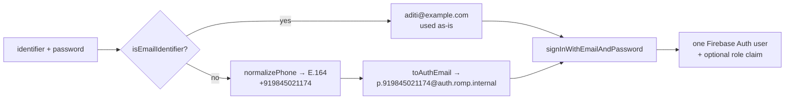

# Identity

Customers sign in with **email or mobile, plus a password**. There is no OTP, no SMS, no social
login. Admins exist only because someone seeded them.

Firebase Auth has no mobile-plus-password provider — its phone provider is SMS OTP, which is out of
scope. So mobile identity is built on a deterministic alias. This document explains that mechanism,
its consequences, and the one gap it leaves open.

Decision record: [ADR-0006](adr/0006-password-identity-without-otp.md).

---

## The alias mechanism



`normalizePhone` and `toAuthEmail` are **pure functions in `@romp/core`**, shared verbatim by browser
and server. Client and server therefore agree by construction rather than by convention, and no secret
is needed to derive the alias.

The alias domain (`auth.<brand>.internal`) is non-routable on purpose. It is an internal identifier,
not an address; nothing is ever sent to it.

### Normalisation is total

Every spelling a customer might type must reach one account. This is exhaustively tested:

| Typed             | Normalised      | Alias                               |
| ----------------- | --------------- | ----------------------------------- |
| `9845021174`      | `+919845021174` | `p.919845021174@auth.romp.internal` |
| `098450 21174`    | `+919845021174` | same                                |
| `+91 98450 21174` | `+919845021174` | same                                |
| `+91-98450-21174` | `+919845021174` | same                                |
| `0091 9845021174` | `+919845021174` | same                                |

Bare numbers are interpreted using `locale.defaultPhoneRegion` from store config, so a store operating
outside India changes one config value rather than any code. Parsing uses `libphonenumber-js` — never a
regex, because phone-number validity is not a regular language.

### One account, one login identifier

A Firebase Auth user has a single `email` field, so exactly one identifier can be the credential:

| Registered with | Auth `email`   | Auth `phoneNumber` | `users` doc                                                     |
| --------------- | -------------- | ------------------ | --------------------------------------------------------------- |
| Email           | the real email | unset              | `primaryIdentifierType: 'email'`, `email` set, `phone` optional |
| Mobile          | the alias      | the real E.164     | `primaryIdentifierType: 'phone'`, `phone` set, `email` optional |

The other contact detail is stored as profile data and used for display and support — it is **not** a
second way to sign in. That constraint is stated in the registration UI rather than discovered later.

Note the real number is still written to Auth's `phoneNumber` field even though it is not used for
authentication. That is deliberate: it means adopting a real phone provider in future is a
data-preserving migration, not a re-collection exercise.

---

## Registration

`POST /v1/auth/register` — one transaction, so a partially created account is not representable.

1. Classify the identifier as email or phone.
2. Normalise: lowercase and trim an email; parse a phone to E.164 or reject.
3. Enforce the password policy (below).
4. **Reserve `identityIndex/{normalizedIdentifier}` with a create-only write.** A duplicate fails
   atomically with `IDENTIFIER_TAKEN`.
5. Create the Auth user via the Admin SDK with the derived alias, plus `phoneNumber` when applicable.
6. Create the `users/{uid}` profile with `primaryIdentifierType`.
7. Return; the client then signs in normally with the same derived alias.

`identityIndex` is unreadable by clients. A readable uniqueness index is an account-enumeration
oracle — it would let anyone ask "does this number have an account here". `POST
/v1/auth/check-identifier` exists for registration UX and is rate-limited hard for the same reason.

### Password policy

| Rule           | Value                                                   |
| -------------- | ------------------------------------------------------- |
| Minimum length | 10 characters                                           |
| Strength floor | `zxcvbn` score ≥ 3                                      |
| Blocklist      | The identifier itself, the brand name, common passwords |
| Maximum length | 128 (bcrypt-style truncation is not a surprise we want) |

Composition rules ("one uppercase, one symbol") are deliberately **not** used. They push users toward
predictable patterns and measurably reduce entropy; a strength estimator is a better gate. The UI
shows a live strength meter with specific guidance rather than a generic "invalid password".

---

## Admins

Admins are **seeded**. There is no signup, no invite flow, and no self-service reset for them.

```bash
pnpm seed:admins            # reads infra/admins.config.ts, mints users with a role claim
```

| Property          | Behaviour                                                                                          |
| ----------------- | -------------------------------------------------------------------------------------------------- |
| Creation          | Script only, via Admin SDK                                                                         |
| Authorisation     | `role` custom claim, `owner` or `staff`                                                            |
| Login             | `admin.<domain>/login` — login form only                                                           |
| Identifier        | Email or mobile, same alias mechanism as customers                                                 |
| Roles             | `staff` and `owner` — only an owner may refund or change settings; finer RBAC is a v2 roadmap item |
| Password rotation | Re-run the script, or use the reset endpoint                                                       |

The admin app verifies the claim **server-side** on every request. A customer account holding valid
credentials but no claim is refused with a clear message — not a blank screen, and not a redirect loop.

Custom claims propagate on token refresh. After `seed:admins` grants a claim, that session must
refresh its token (sign out and in, or force-refresh) before the claim is visible. Documented so it
is not mistaken for a bug.

---

## Password reset — including the gap

This is the one place where excluding both email and OTP has a real cost. Stating it plainly:

| Account type           | Path                                     | Self-service? |
| ---------------------- | ---------------------------------------- | ------------- |
| Email identifier       | Firebase's built-in password-reset email | ✅ Yes        |
| Mobile-only identifier | Admin-assisted via WhatsApp              | ❌ No         |

**Why an email is sent at all when the platform "sends no email":** Firebase's reset email is an
authentication primitive issued by Firebase, not a communication channel the platform operates. No
marketing, transactional or order email exists. The distinction is recorded in
[ADR-0007](adr/0007-notifications-not-email.md).

### Mobile-only reset flow

1. The customer messages the store on WhatsApp (the CTA is present throughout the storefront).
2. An admin verifies identity against order history — recent order reference, delivery pincode, name.
3. The admin calls `POST /v1/admin/users/:uid/password-reset`, which mints a **single-use link with a
   short TTL**.
4. The admin sends the link over WhatsApp. The customer sets a new password.
5. The action is audited with the acting admin's uid.

Procedure and identity-verification questions: [`RUNBOOKS.md § password reset`](RUNBOOKS.md).

### Risks accepted, and their bounds

| Risk                                     | Bound                                                                                                           |
| ---------------------------------------- | --------------------------------------------------------------------------------------------------------------- |
| Social engineering an admin into a reset | Identity verification against order history is scripted in the runbook; every reset is audited and attributable |
| Does not scale with volume               | Acceptable at launch; WhatsApp Business API OTP in v1.1 removes the human entirely                              |
| Admin availability gates recovery        | Support hours are published in config; customers are told the channel                                           |

The fix is already sequenced: [`ROADMAP.md` item 1](ROADMAP.md) makes WhatsApp OTP the first
post-launch item precisely because this is the worst gap in v1.0.

---

## Sessions

| Concern               | Behaviour                                                                  |
| --------------------- | -------------------------------------------------------------------------- |
| Token                 | Firebase ID token, 1-hour expiry, SDK-refreshed                            |
| Server verification   | Every API request verifies the token; nothing trusts a client-supplied uid |
| Revocation            | `revokeRefreshTokens` on password change                                   |
| Anonymous → signed-in | Cart merges server-side on sign-in; no items lost                          |
| Sign-out              | Clears the session and detaches Firestore listeners                        |

---

## Rate limits and abuse

| Surface                          | Control                                                                                       |
| -------------------------------- | --------------------------------------------------------------------------------------------- |
| `POST /v1/auth/register`         | 5/hour/IP, at Cloudflare and in-process                                                       |
| `POST /v1/auth/check-identifier` | 20/hour/IP — enumeration surface                                                              |
| Sign-in attempts                 | Firebase Auth throttling + a Cloudflare rate rule                                             |
| Admin login                      | Same, plus failures logged with IP and identifier **type** — never the identifier or password |
| Reset-link minting               | Admin-only, audited, single-use, short TTL                                                    |

Logs never contain passwords, tokens, or phone numbers; redaction is enforced by the logger's
configured redaction paths, not by reviewer vigilance.

---

## Testing

| Assertion                                                          | Layer              |
| ------------------------------------------------------------------ | ------------------ |
| Five phone spellings map to one alias; junk is rejected            | Unit, `@romp/core` |
| Register with mobile, sign in with a different spelling → same uid | Integration        |
| Duplicate identifier → `IDENTIFIER_TAKEN`, no orphan Auth user     | Integration        |
| Weak password → `WEAK_PASSWORD` with specific guidance             | Route              |
| No token → 401; customer token on an admin route → 403             | Route              |
| `identityIndex` is unreadable by any client                        | Rules              |
| Reset link is single-use and expires                               | Integration        |
| Password change revokes existing refresh tokens                    | Integration        |
| Logs contain no phone number, password or token                    | Unit, redaction    |
