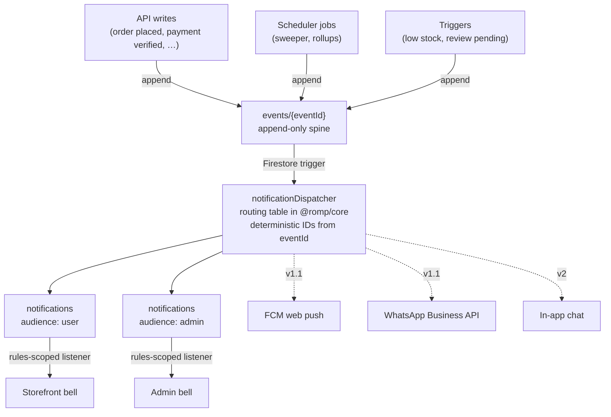

# Notifications

The platform sends **no email** ([ADR-0007](adr/0007-notifications-not-email.md)). In-app
notifications are therefore not a nice-to-have — they are the only push channel to customers and
admins. That raises their liveness to a customer-facing concern, which is why the dispatcher has its
own alert and why notifications are derived rather than authored.

---

## Design in one picture



Three properties follow from this shape, and each one matters:

1. **Notifications are derived, never authored.** A feature emits a domain _event_; it never writes a
   notification. So adding a recipient or a channel is a routing-table change, not a change to the
   order code.
2. **Delivery is idempotent.** The dispatcher writes documents whose IDs are deterministic functions
   of `(eventId, audience, recipient)`. Firestore retries the trigger; the second write is a no-op.
3. **Outages are recoverable.** Because `events` is append-only and notifications are derived, a
   dispatcher outage is fixed by replaying the event range — with no duplicates.

---

## Event catalogue

Events are facts about the past, named `noun.verb-past-tense`. Each carries a Zod-validated payload.

| `type`                     | Emitted by                          | Payload                                                     |
| -------------------------- | ----------------------------------- | ----------------------------------------------------------- |
| `order.created`            | `POST /v1/orders`                   | `orderId`, `humanId`, `userId`, `totalMinor`, `itemCount`   |
| `order.payment_submitted`  | `POST /v1/orders/:id/payment-proof` | `orderId`, `humanId`, `userId`, `hasScreenshot`             |
| `order.payment_verified`   | admin verify                        | `orderId`, `humanId`, `userId`, `verifiedBy`                |
| `order.payment_rejected`   | admin reject                        | `orderId`, `humanId`, `userId`, `reason`, `rejectedBy`      |
| `order.expired`            | reservation sweeper                 | `orderId`, `humanId`, `userId`                              |
| `order.packed`             | fulfilment transition               | `orderId`, `humanId`, `userId`                              |
| `order.shipped`            | fulfilment transition               | `orderId`, `humanId`, `userId`, `carrier`, `trackingNo`     |
| `order.delivered`          | fulfilment transition               | `orderId`, `humanId`, `userId`                              |
| `order.cancelled`          | admin cancel                        | `orderId`, `humanId`, `userId`, `reason`                    |
| `refund.issued`            | `POST /v1/admin/refunds`            | `refundId`, `orderId`, `humanId`, `userId`, `amountMinor`   |
| `review.submitted`         | `POST /v1/reviews`                  | `reviewId`, `productId`, `userId`                           |
| `review.published`         | admin moderation                    | `reviewId`, `productId`, `userId`, `productSlug`            |
| `review.rejected`          | admin moderation                    | `reviewId`, `productId`, `userId`, `reason`                 |
| `inventory.low_stock`      | inventory transaction               | `variantId`, `productId`, `sku`, `remaining`, `warehouseId` |
| `inventory.out_of_stock`   | inventory transaction               | `variantId`, `productId`, `sku`                             |
| `sweeper.anomaly`          | reservation sweeper                 | `detail`, `affectedCount`                                   |
| `account.password_changed` | `POST /v1/auth/password-change`     | `userId`                                                    |
| `account.address_added`    | `POST /v1/addresses`                | `userId`, `addressLabel`                                    |

---

## Routing table

Lives in `packages/core` as data, not branching logic — so it is exhaustively testable and readable
in one screen.

| Event                      | → Customer             | → Admin                   |
| -------------------------- | ---------------------- | ------------------------- |
| `order.created`            | `order_placed`         | `new_order`               |
| `order.payment_submitted`  | `payment_under_review` | `payment_proof_submitted` |
| `order.payment_verified`   | `payment_verified`     | —                         |
| `order.payment_rejected`   | `payment_rejected`     | —                         |
| `order.expired`            | `order_expired`        | —                         |
| `order.packed`             | `order_packed`         | —                         |
| `order.shipped`            | `order_shipped`        | —                         |
| `order.delivered`          | `order_delivered`      | —                         |
| `order.cancelled`          | `order_cancelled`      | —                         |
| `refund.issued`            | `refund_issued`        | —                         |
| `review.submitted`         | —                      | `review_pending`          |
| `review.published`         | `review_published`     | —                         |
| `review.rejected`          | —                      | —                         |
| `inventory.low_stock`      | —                      | `low_stock`               |
| `inventory.out_of_stock`   | —                      | `out_of_stock`            |
| `sweeper.anomaly`          | —                      | `sweeper_anomaly`         |
| `account.password_changed` | `password_changed`     | —                         |
| `account.address_added`    | `address_added`        | —                         |

Deliberate omissions worth noting:

- **No customer notification on rejected reviews.** Rejection reasons are frequently moderation
  judgements; surfacing them invites argument and adds no value. The review simply never appears.
- **No admin notification for routine fulfilment steps.** An admin performed the action; telling them
  they did it is noise. Notification fatigue makes a channel useless, and this is the only channel.

---

## Audiences and read state

| Audience | Targeting                                      | Read state                       |
| -------- | ---------------------------------------------- | -------------------------------- |
| `user`   | One document per recipient, `userId` set       | `readAt` timestamp               |
| `admin`  | One document, `audience: 'admin'`, no `userId` | `readBy: { uid: Timestamp }` map |

Admin notifications are a single shared document with a per-admin read map, so admins do not have to
coordinate and each has independent unread state. This works because the admin set is small and
seeded; with many admins, a per-admin fan-out would be the better shape.

### Security rules

Clients read only what belongs to them and may write **only** their own read state. That is two
separate rules, not one permitting both fields — see `infra/firestore.rules`:

```
match /notifications/{id} {
  allow read: if isAddressee() || isStaffAudience();

  // A customer marks their own notification read.
  allow update: if isAddressee()
    && onlyChanged(['readAt'])
    && request.resource.data.readAt == request.time
    && resource.data.readAt == null;

  // A staff member marks a staff notification read for themselves only.
  allow update: if isStaffAudience()
    && onlyChanged(['readBy'])
    && request.resource.data.readBy
         .diff(resource.data.get('readBy', {})).affectedKeys().hasOnly([uid()])
    && request.resource.data.readBy[uid()] == request.time
    && !(uid() in resource.data.get('readBy', {}).keys());

  allow create, delete: if false;   // dispatcher only, via Admin SDK
}
```

Four clauses are load-bearing, and each has its own deny-case test in
`infra/tests/rules/notifications.test.ts`.

`onlyChanged` is what stops a client rewriting a notification's title, body or deep link. A writable
`link` in particular is an open-redirect and a phishing primitive **inside the customer's own account
area**, which is the last place a customer would be suspicious of a link.

`== request.time` makes the timestamp a fact about when the server saw the write rather than a claim by
the client. Without it, read state can be backdated.

`resource.data.readAt == null` means there is no un-reading and no re-stamping. Idempotence here is a
**denial**, not an overwrite: permitting a rewrite would let a client churn the document indefinitely
at our cost.

The **nested** `readBy` diff scoped to `[uid()]` is the one that matters most. Without it, one admin
could mark a notification read on another admin's behalf — hiding a new order from the person it was
meant for, which is worse than the notification never arriving because it looks handled.

A single `readAt` shared across the admin audience would have the same effect for the whole team at
once, which is why the two audiences do not share a field. The document schema enforces the split too:
a `user` notification with a non-empty `readBy`, or an `admin` notification with a non-null `readAt`,
fails validation on read as well as on write.

---

## Copy templates

Titles and bodies are **not** literals in the dispatcher. They come from
`store.config.ts → content.notifications`, so a rebrand restyles notifications along with everything
else, and a store can adopt its own voice.

```ts
notifications: {
  order_placed: {
    title: 'Order {orderRef} placed',
    body: 'We’ll confirm as soon as your payment is verified.',
  },
  payment_verified: {
    title: 'Payment received for {orderRef}',
    body: 'Your toys are being packed. We’ll let you know when they ship.',
  },
  // …
}
```

Interpolation tokens are validated against the event payload at build time, so a template referencing
`{trackingNo}` on an event that has no tracking number fails the config test rather than rendering
`{trackingNo}` to a customer.

---

## Client behaviour

| Concern            | Behaviour                                                                                      |
| ------------------ | ---------------------------------------------------------------------------------------------- |
| Transport          | Firestore `onSnapshot` — real-time, no polling                                                 |
| Query              | `where(userId == uid)` or `where(audience == 'admin')`, `orderBy(createdAt desc)`, `limit(20)` |
| Badge              | Count of unread within the window; caps display at `9+`                                        |
| Grouping           | By day: Today / Yesterday / Earlier                                                            |
| Mark read          | Optimistic local update, then the narrow field write                                           |
| Mark all read      | Roadmap — a batched, per-batch-capped write; the v1.0 bell marks read one item at a time       |
| Pagination         | Roadmap — cursor on `createdAt`; the v1.0 bell shows the most recent 20 without a "load more"  |
| Empty state        | Configured copy, not a bare "no notifications"                                                 |
| Listener lifecycle | Detached on sign-out and on tab hide, to avoid leaking a listener per navigation               |

---

## Failure modes

| Failure                                     | Effect                                                  | Mitigation                                                                                                             |
| ------------------------------------------- | ------------------------------------------------------- | ---------------------------------------------------------------------------------------------------------------------- |
| Dispatcher errors on one event              | That notification is missing                            | Firestore retries; deterministic IDs make retry safe; persistent failure raises the backlog alert                      |
| Dispatcher stalls entirely                  | **Customers hear nothing** — there is no email fallback | Backlog alert on unprocessed `events` age; order status remains readable on the account page and order page regardless |
| Template references a missing payload field | Would render a raw token to a customer                  | Prevented at build time by template validation                                                                         |
| Notification volume floods a customer       | Channel becomes ignorable                               | Routing table is deliberately sparse; no notification for actions the recipient performed                              |
| Client listener leaks                       | Memory growth, quota burn                               | Listeners detached on sign-out and tab hide; asserted in tests                                                         |

The second row is the important one. **A stalled dispatcher is silent customer harm**, so it is
alerted on _backlog age_, not merely on error rate — a dispatcher that has stopped being invoked
produces no errors at all.

---

## Extension points (roadmap)

The dispatcher is deliberately transport-agnostic. Each of these adds a sender; none changes the
`events` spine or the routing table's shape.

| Channel               | Version | Notes                                                                       |
| --------------------- | ------- | --------------------------------------------------------------------------- |
| WhatsApp Business API | v1.1    | Highest value: also closes the mobile password-reset gap via OTP            |
| FCM web push          | v1.1    | Reaches customers who closed the tab; needs a non-nagging permission prompt |
| In-app chat           | v2.0    | Reuses `events` for unread state                                            |
| Email                 | —       | Not planned. [ADR-0007](adr/0007-notifications-not-email.md)                |

---

## Testing

| Assertion                                                            | Layer              |
| -------------------------------------------------------------------- | ------------------ |
| Every event type has a routing entry (exhaustive over the enum)      | Unit, `@romp/core` |
| Replaying one event produces exactly one notification per recipient  | Emulator           |
| Admin fan-out reaches every seeded admin with independent read state | Emulator           |
| A user cannot read another user's notifications                      | Rules              |
| An update touching any field other than read state is denied         | Rules              |
| Unread count is correct with two tabs marking read concurrently      | Integration        |
| Every template's interpolation tokens exist on its event payload     | Unit, config       |
| Listener is detached on sign-out                                     | Component          |
