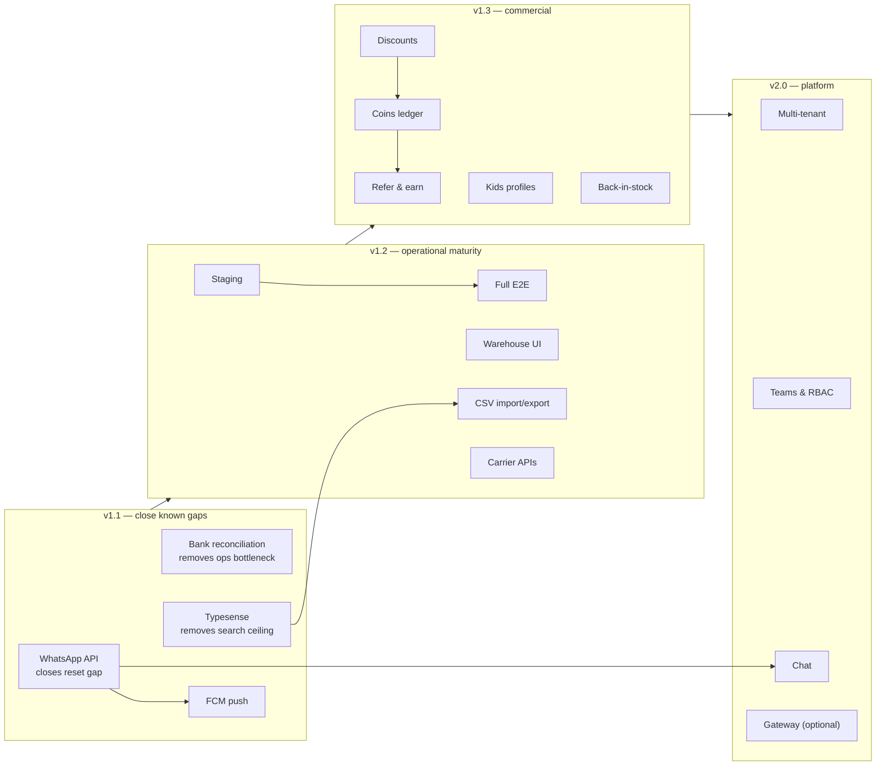

# Roadmap

Post-v1.0 plan. Ordered by a simple rule: **things that reduce operational pain or close a known gap
come before things that add surface area.**

Nothing here is committed scope. It is a sequenced backlog with the reasoning attached, so that when
a decision is revisited the original constraint is visible.

---

## v1.1 — Close the gaps v1.0 knowingly left open

These exist because v1.0 made deliberate trade-offs. They are the highest-value work after launch.

### 1. WhatsApp Business API integration

**Why first.** It closes the single worst gap in v1.0: mobile-only customers cannot reset their own
password, because there is no email and no OTP ([ADR-0006](adr/0006-password-identity-without-otp.md)).
Today that requires an admin in the loop, which does not scale and is a social-engineering surface.

**Delivers**

- OTP-based password reset for mobile accounts, removing admin-assisted reset.
- Notification delivery over WhatsApp as a second channel alongside the in-app bell — a stalled
  dispatcher stops being silent customer harm.

**Shape.** A new sender behind the existing dispatcher extension point. The routing table already
names recipients and templates; this adds a transport. No change to the `events` spine.

### 2. Bank-statement reconciliation for UPI

**Why.** Manual UTR verification is the ops bottleneck and the fraud surface. The QR already encodes
the exact amount and order reference precisely so that matching can be mechanical.

**Delivers** CSV/statement import that auto-matches settlements to pending orders by amount +
reference, presenting only exceptions to a human. Verification becomes review-by-exception.

**Guardrails.** Auto-match still writes the same audit events; no order reaches `paid` without a
recorded, attributable decision (system or human).

### 3. Typesense search

**Why.** v1.0 search is prefix matching on normalised tokens, and facet counts come from maintained
counters. That is honest for a few thousand SKUs and degrades as the catalogue grows or as customers
expect typo tolerance.

**Delivers** Typo-tolerant full-text search, true facet counts, richer multi-filter combinations,
and removal of the Firestore `in`-limit-of-10 constraint on category filters.

**Shape.** A second `SearchPort` implementation plus a sync Function on product write. UI and domain
code do not change — that was the point of [ADR-0002](adr/0002-firestore-search-port.md).

### 4. FCM web push

**Why.** Cheap once the dispatcher exists, and it reaches customers who have closed the tab.

**Shape.** Another dispatcher transport. Requires a permission-request UX that does not nag.

---

## v1.2 — Operational maturity

### 5. Staging environment

A third Firebase project between dev and prod, with seeded representative data. v1.0 runs dev + prod
because two environments are honest for a small team; a staging tier earns its keep once releases
involve more than one person.

### 6. Full Playwright E2E suite

v1.0 ships a smoke test of the purchase path. Expand to: registration with both identifier types,
filter and sort permutations, variant selection, reservation expiry, payment rejection and
resubmission, refund, and the admin fulfilment path.

### 7. Admin warehouse management UI

v1.0 seeds warehouses from config, and the inventory UI already iterates them dynamically — so this
is CRUD over an existing shape, not a new concept.

### 8. CSV import/export

Bulk product import and order/customer export. Wanted by operations the moment the catalogue grows
beyond hand-editing.

### 9. Shipping-carrier API integration

Replace manually entered tracking numbers with carrier APIs: label generation, automatic status
updates feeding the existing fulfilment state machine and notification pipeline.

---

## v1.3 — Commercial features

Deferred from v1.0 not because they are hard to build but because each one touches money or identity
and deserves its own design pass.

### 10. Discounts and coupons

**Why deferred.** A discount engine touches every price path — cart quote, order snapshot, refund
maths, analytics. Introducing it after the price path is stable and tested is materially safer than
building it into the first version.

**Scope when built.** Percentage / fixed / free-shipping / BOGO, scoping by category and age band,
per-customer usage caps, stacking rules, scheduling windows, and forecasting. The prototype's
discount builder is the reference design.

### 11. Loyalty coins ledger

**Why deferred.** A points balance is a financial ledger. It needs idempotent accrual, reconciliation,
expiry handling and an audit trail of its own — the same rigour as the payment path.

**Scope.** Earn on delivered orders, redeem at checkout, immutable ledger entries, balance derived
from entries rather than stored as a mutable number.

### 12. Refer & earn

Depends on the coins ledger. Also needs fraud rules (self-referral, disposable identifiers, reward
only after the referred order clears the return window), which is the real work.

### 13. Kids profiles

Age-based personalisation and gift reminders. Deferred additionally because storing children's data
warrants deliberate privacy design and a clear retention policy, not a convenient afterthought.

### 14. Back-in-stock notifications

Customers subscribe on a sold-out variant; a Function emits an event when stock returns. The
dispatcher and audience model already support it.

---

## v2.0 — Platform

### 15. Multi-tenant mode

**Why not now.** v1.0 is single-tenant by deliberate choice
([ADR-0005](adr/0005-single-tenant-white-label.md)): complete data isolation for a payments system,
per-store scaling and cost attribution, and no `tenantId` in every query and every security rule.

**Why it may change.** Once store count makes per-store deploys and per-store Firebase projects the
dominant operational cost, the calculus flips.

**Migration path, already prepared.** Every repository method takes a `StoreContext`. Adding
`tenantId` means threading it through that existing parameter, adding it to composite indexes, and
adding one clause to each security rule — mechanical, not a rewrite.

### 16. Admin teams and RBAC

Invitations, roles (owner / ops / catalogue / finance / support), scoped permissions, per-admin audit
views. v1.0's seeded single-role admins are sufficient at launch and avoid building a permission
system before the permissions are known.

### 17. Customer ↔ admin chat

The originally intended support channel. WhatsApp covers v1.0. When built, it reuses the `events`
spine and the notification pipeline for unread state and delivery.

### 18. Payment gateway (optional)

Only if the business wants cards, netbanking, wallets or EMI. The order state machine already
separates payment status from fulfilment status, so a gateway becomes an additional payment method
with automatic verification, not a re-architecture. Manual UPI remains available alongside.

---

## Explicitly not planned

| Item                        | Reason                                                                             |
| --------------------------- | ---------------------------------------------------------------------------------- |
| Cash on delivery            | Product decision; reconsider only with evidence of demand and a returns-cost model |
| Email as a customer channel | Product decision; WhatsApp + in-app is the chosen strategy                         |
| MFA for customers           | Product decision; revisit if account-takeover incidents appear                     |
| Native mobile apps          | The storefront is responsive; the API exists if this changes                       |

---

## Sequencing rationale

The three v1.1 items each remove a constraint that v1.0 accepted knowingly. Everything after that
adds capability. Keeping that order means the platform stops having known holes before it starts
growing new surface.
