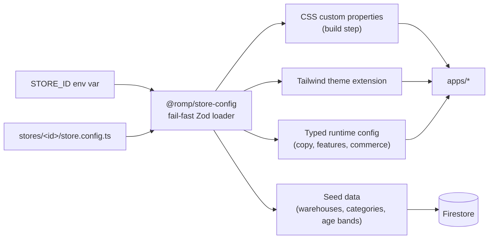

# White-labelling

The platform is generic. **ROMP is a configuration, not the product.** Brand, palette, typography,
copy, locale, currency formatting, feature set, age bands, categories, warehouses and commerce
parameters all live in one validated config file per store.

The contract this document defines: **creating a new store requires zero changes under `apps/` or
`packages/`.** That is verified by CI, not by discipline alone.

---

## How it fits together



One config, four consumers. Colours reach components as CSS variables _and_ as Tailwind tokens, so
neither utility classes nor inline styles need a literal.

---

## Store directory

```
stores/
├── romp/
│   ├── store.config.ts     the single source of brand truth
│   ├── seed.catalogue.ts   starting products, written by `pnpm seed`
│   ├── package.json        @romp/store-romp — a workspace package, so imports resolve
│   ├── tsconfig.json
│   ├── assets/
│   │   ├── logo-dark.svg    wordmark for dark surfaces
│   │   ├── logo-light.svg
│   │   ├── mark.svg         square mark, for the mobile header and favicon source
│   │   ├── favicon.svg
│   │   └── og-fallback.png  1200×630, used when a page has no image
│   └── fonts/               optional self-hosted faces
└── _template/               scaffold consumed by `pnpm store:new`
```

Two things about `_template` worth knowing:

- **It is a valid, working store, not a file full of `TODO`s.** A new store should render
  on the first `pnpm dev` so the author can rebrand against something they can see,
  rather than against a stack of validation errors.
- **It is deliberately unlike ROMP** — a light theme, different fonts, different age
  bands, one warehouse instead of two, and a different feature set. That is what makes
  it useful as the second config in the test matrix: anything that quietly assumes
  ROMP's palette, fonts, feature set or warehouse count fails against it.

A leading underscore marks a directory as a scaffold. `resolveStoreId` refuses to deploy
one, and `listStoreIds()` leaves it out of the deployable set — but it is still
validated on every test run, because a scaffold that has rotted hands the next person a
broken config.

---

## Configuration reference

Every key is validated. A missing or nonsensical value **fails the build with the exact path**, rather
than rendering a half-branded store.

### `brand`

| Key           | Type   | Purpose                                                   |
| ------------- | ------ | --------------------------------------------------------- |
| `id`          | slug   | Must equal the directory name                             |
| `name`        | string | Wordmark and page titles — "ROMP"                         |
| `legalName`   | string | Invoices and policy pages — "ROMP Retail Private Limited" |
| `tagline`     | string |                                                           |
| `orderPrefix` | string | Order references and the UPI note — `RMP` → `RMP-24817`   |
| `logos`       | map    | `{ dark, light, mark, favicon }` — paths within `assets/` |
| `ogFallback`  | path   | Social image fallback                                     |

### `theme`

| Key                                                  | Type                           | Purpose                                                                                |
| ---------------------------------------------------- | ------------------------------ | -------------------------------------------------------------------------------------- |
| `colors.page`                                        | hex                            | Page background — ROMP: `#131417`                                                      |
| `colors.surface`                                     | hex                            | Card background — `#161719`                                                            |
| `colors.surfaceAlt`                                  | hex                            | Alternate card — `#191a1d`                                                             |
| `colors.surfaceDeep`                                 | hex                            | Deepest panel — `#0e0e10`                                                              |
| `colors.primary`                                     | hex                            | Primary action — `#d8fd4f`                                                             |
| `colors.primaryOn`                                   | hex                            | Text on primary — `#0e0e10`                                                            |
| `colors.accent`                                      | hex                            | Accent / sale — `#ff6f5e`                                                              |
| `colors.accentOn`                                    | hex                            | Text on accent — `#3d0f08`                                                             |
| `colors.textPrimary` / `textSecondary` / `textMuted` | hex                            | Text ramp. All three gated at AA normal text                                           |
| `colors.border`                                      | hex                            | Decorative divider — **not** contrast-gated, see below                                 |
| `colors.borderStrong`                                | hex                            | Interactive boundary — input outlines, selected states. Gated at 3:1                   |
| `colors.focusRing`                                   | hex                            | Focus indicator. Gated at 3:1 against every surface                                    |
| `colors.success` / `warning` / `danger`              | hex                            | Status colours, gated at AA normal text                                                |
| `radii`                                              | map                            | `{ sm, md, lg, pill }` — CSS lengths                                                   |
| `shadows`                                            | map                            | `{ card, overlay }`                                                                    |
| `fonts.display`                                      | map                            | `{ family, weights[], source: 'google' \| 'local', fallback[] }` — ROMP: Archivo Black |
| `fonts.body`                                         | map                            | ROMP: Archivo                                                                          |
| `motion.intensity`                                   | `'full' \| 'subtle' \| 'none'` | Scales `durationMs` by 1, 0.6 and 0 respectively                                       |
| `motion.durationMs`                                  | integer                        | Base transition duration, before scaling                                               |
| `motion.easing`                                      | string                         | CSS timing function                                                                    |

`fonts.*.weights` is an explicit list rather than "all", because each weight is bytes on
the LCP path and an unused one is pure cost.

`motion.intensity` is a **brand** control, not an accessibility one.
`prefers-reduced-motion` always wins, and it is honoured in the emitted stylesheet rather
than in each component — so a component that forgets the media query still animates for
zero milliseconds.

### Contrast is a release gate

A white-label platform hands palette choices to whoever configures the next store.
Without a gate, the accessibility problem lands on the least-equipped person to notice
it, so a config below WCAG AA **cannot ship**: `pnpm --filter @romp/store-config test`
fails and lists every offending pair with its measured ratio.

What is gated:

| Pair                                             | Bar   | Why                                                                                           |
| ------------------------------------------------ | ----- | --------------------------------------------------------------------------------------------- |
| Every text colour on every surface               | 4.5:1 | Body text. Includes `textMuted` — "muted" is a visual intent, not permission to be unreadable |
| `primaryOn` on `primary`, `accentOn` on `accent` | 4.5:1 | Button labels: the most important text on the page                                            |
| `primary` / `accent` as text on surfaces         | 4.5:1 | Prices and links use them                                                                     |
| Status colours on surfaces                       | 4.5:1 | A danger message nobody can read is worse than none                                           |
| `borderStrong`, `focusRing` on surfaces          | 3:1   | A focus ring that cannot be seen makes the keyboard purchase path unusable                    |

`border` is deliberately **not** gated. It is a decorative hairline between two surfaces
of similar lightness, WCAG's 3:1 non-text rule covers components and state indicators
that carry meaning rather than ornament, and gating it would force every dark theme to
draw dividers in mid-grey for no accessibility gain. `borderStrong` carries the
interactive cases and is gated.

### `locale`

| Key                  | Type       | Purpose                                                       |
| -------------------- | ---------- | ------------------------------------------------------------- |
| `currency`           | ISO 4217   | `INR`                                                         |
| `locale`             | BCP 47     | `en-IN` — drives `Intl` number and date formatting            |
| `timezone`           | IANA       | `Asia/Kolkata`                                                |
| `defaultPhoneRegion` | ISO 3166-1 | `IN` — how a bare `9845021174` is interpreted                 |
| `gstRateBasisPoints` | integer    | `1800` = 18%. Basis points for the same reason money is paise |

### `content`

All customer-visible copy. Nothing user-facing is a literal in a component.

| Key                                          | Purpose                                                                             |
| -------------------------------------------- | ----------------------------------------------------------------------------------- |
| `home.hero`                                  | `{ eyebrow, headline, subcopy, primaryCta, secondaryCta }`                          |
| `home.promo`                                 | `{ headline, subcopy, cta }`                                                        |
| `home.trustBadges[]`                         | `{ title, description }`                                                            |
| `home.ageSectionTitle`, `home.featuredTitle` | Section headings                                                                    |
| `ageBands[]`                                 | `{ value, label, note }` — **the age taxonomy itself.** ROMP: `0–2, 3–5, 6–8, 9–12` |
| `categories[]`                               | Seed categories: `{ name, slug, parent?, showInFilters, showInNav, sortOrder }`     |
| `footer`                                     | `{ columns[], legalLine }`                                                          |
| `policies`                                   | `{ returns, shipping, privacy, terms }` — copy or route references                  |
| `notifications`                              | Title/body templates per notification type                                          |
| `emptyStates`                                | Copy for no-results, empty cart, empty wishlist                                     |

### `contact`

| Key                | Purpose                                                  |
| ------------------ | -------------------------------------------------------- |
| `whatsappNumber`   | E.164. Powers every support deep link                    |
| `whatsappGreeting` | Pre-filled message template, `{orderRef}` interpolated   |
| `supportHours`     | Display string                                           |
| `supportEmail`     | Optional, **display only** — the platform sends no email |

### `features`

Booleans that remove a capability from the UI _and_ from the server contract, so a disabled feature
cannot be reached by a crafted request.

| Flag               | Effect when `false`                                        |
| ------------------ | ---------------------------------------------------------- |
| `reviews`          | No submission, no PDP review section, review routes refuse |
| `wishlist`         | No hearts, no account section, routes refuse               |
| `giftWrap`         | Removed from cart UI and from the quote                    |
| `expressDelivery`  | Only standard shipping offered                             |
| `deliveryEstimate` | PDP pincode estimator hidden                               |

### `commerce`

Seeds `settings/checkout`, which is then editable in admin without a deploy.

| Key                          | Type    | Purpose                      |
| ---------------------------- | ------- | ---------------------------- |
| `upi.vpa`                    | string  | Payee VPA in the QR          |
| `upi.payeeName`              | string  | Payee name in the QR         |
| `reservationTtlMinutes`      | integer | Stock hold window — ROMP: 30 |
| `giftWrapFeeMinor`           | integer | 9900 = ₹99                   |
| `expressFeeMinor`            | integer | 14900 = ₹149                 |
| `freeShippingThresholdMinor` | integer | 149900 = ₹1,499              |
| `lowStockThreshold`          | integer | Default per variant          |

### `warehouses[]`

One or many. Count is data; the admin inventory UI iterates this list, so nothing in the UI assumes
a number.

| Key                        | Purpose                          |
| -------------------------- | -------------------------------- |
| `code`                     | Document ID — `blr`              |
| `name`, `city`, `pincode`  |                                  |
| `priority`                 | Allocation order, lower first    |
| `active`                   |                                  |
| `servicePincodePrefixes[]` | Delivery-estimate serviceability |

---

## Creating a new store

```bash
pnpm store:new toybox
```

Scaffolds `stores/toybox/` from `_template`, rewrites `brand.id`, `name`, `legalName` and
`orderPrefix` from the store ID, renames the package, and prints this checklist. It
refuses to overwrite an existing directory — a store config is hand-written work and a
scaffolding command should not be able to clobber it.

The result is already valid, so look at it before changing anything:

```bash
pnpm install
STORE_ID=toybox pnpm store:tokens
STORE_ID=toybox pnpm dev
```

Then:

1. **Edit `stores/toybox/store.config.ts`** — brand, palette, fonts, copy, locale, features, commerce,
   warehouses, categories, age bands.
2. **Replace `stores/toybox/assets/`** — logos, mark, favicon, OG fallback.
3. **Edit `stores/toybox/seed.catalogue.ts`** — the starting products. Every `category` is a slug from
   `content.categories`, every `ageBand` a value from `content.ageBands`, and every `stock` key a
   warehouse `code`; the loader cross-checks all three and reports every mismatch in one pass. Prices
   are integer **paise**. The file is optional — a store importing its catalogue from elsewhere can
   delete it and still seed warehouses, categories and settings.
4. **Validate** — `STORE_ID=toybox pnpm --filter @romp/store-config test` fails with exact paths if
   anything is missing, if an asset path does not resolve, if a catalogue reference is unresolvable, or
   if any palette pair falls below AA.
5. **Preview** — `STORE_ID=toybox pnpm dev`.
6. **Create the Firebase projects** — `toybox-dev`, `toybox-prod`, region `asia-south1`, Auth with
   Email/Password only. Follow [`ARCHITECTURE.md` §7](ARCHITECTURE.md#7-deployment-topology).
7. **Seed** — `pnpm seed --store toybox --project toybox-dev --dry-run` first, then without the flag.
   Re-running is safe: seeded document IDs are natural keys, so a second run updates rather than
   duplicates ([`DATA_MODEL.md § seeded document IDs`](DATA_MODEL.md#seeded-document-ids)). Then
   `STORE_ID=toybox pnpm seed:admins`.
8. **Set the deploy env** in `apps/storefront/apphosting.yaml`. Three values are per-deployment,
   not brand config, so they live here rather than in `store.config.ts`: `STORE_ID` (which store to
   build), `NEXT_PUBLIC_SITE_URL` (absolute base for canonical and share-preview URLs — unset, every
   Open Graph image resolves against localhost), and `NEXT_PUBLIC_MEDIA_BASE_URL` (the public base for
   product media; unset, product cards render a placeholder rather than a broken image). None is a
   secret; all three are hostnames or identifiers.
9. **Deploy** — run the workflow with `STORE_ID=toybox`.
10. **Domains** — verify grey-clouded at Cloudflare, _then_ enable proxying with SSL Full (strict).
    See [ADR-0003](adr/0003-cloudflare-fronting-firebase.md); the order matters.

---

## Generated artefacts

`pnpm store:tokens` validates the active store and writes five files into
`packages/store-config/generated/`, which is gitignored — they are build outputs, and
committing them would create a second source of truth that can disagree with the config.

Into `packages/store-config/generated/`:

| File                 | Consumer                                                                      |
| -------------------- | ----------------------------------------------------------------------------- |
| `theme.css`          | The Tailwind `@theme` block plus this store's `:root` values                  |
| `public-config.json` | The browser bundle: brand, theme, copy, features, contact, cart-relevant fees |
| `store-config.json`  | Server-side consumers that legitimately need warehouses                       |
| `active-store.ts`    | `ACTIVE_STORE_ID`, for code that needs to name the store                      |

And into every app, so each one has them on a relative path its own bundler and CSS graph
can see:

| File                               | Consumer                                 |
| ---------------------------------- | ---------------------------------------- |
| `src/generated/theme.css`          | `@import`ed by the app's CSS entry point |
| `src/generated/fonts.ts`           | `next/font` declarations — see below     |
| `src/generated/public-config.json` | Imported by `src/lib/store.ts`           |
| `public/brand/*`                   | Logos, mark, favicon and OG fallback     |

### Tailwind 4 and the `@theme` block

Tailwind 4 is configured in CSS, not JavaScript, so `theme.css` opens with an
`@theme inline` block mapping Tailwind's token namespaces onto our custom properties:

```css
@theme inline {
  --color-primary: var(--store-color-primary);
  --font-display: var(--store-font-display);
}
```

`inline` is load-bearing. Without it, `bg-primary` bakes the resolved hex in at build time
and the `:root` override is ignored — which would make switching stores a Tailwind rebuild
rather than a different stylesheet.

### Fonts have to be generated

`next/font` is **statically analysed**: `import { Archivo } from 'next/font/google'` with a
literal family name. There is no runtime API, so a font cannot be read from a config object
at request time. `src/generated/fonts.ts` is emitted with the configured families, their
explicit weight lists and `display: 'swap'`, and exports a class name the root layout puts
on `<html>`.

The stylesheet then declares:

```css
--store-font-display: var(--font-store-display, 'Archivo Black', ui-sans-serif, sans-serif);
```

One declaration, correct in three cases: the webfont loaded and `next/font` defined the
variable; the family happens to be installed locally; or neither, and the fallback stack
applies.

`public-config.json` deliberately **excludes warehouse detail**. Addresses and PIN
prefixes are operational information with no client use, and shipping them would put the
store's logistics footprint in a public bundle for nothing.

### The token namespace is `--store-`, not the brand

Custom properties are `--store-color-primary`, `--store-radius-md` and so on.

Naming them `--romp-*` would put the first store's name in every other store's
stylesheet — exactly the leak this document exists to prevent — and it would make the
`no-hardcoded-brand` rule fire on every legitimate token reference, forcing an exemption
broad enough to hide real violations. The lint rule caught this during Task 4.

---

## How the contract is enforced

Good intentions decay. Three mechanisms keep branding out of code:

1. **`no-hardcoded-brand` ESLint rule** — fails any hex, `rgb()`, `hsl()` or `oklch()`
   literal, and any whole-word occurrence of a configured brand name, in app code. Apply
   it with `createAppConfig({ brandNames })` from `@romp/config/eslint/app`; `brandNames`
   is a required argument, because a check that silently has nothing to match is worse
   than no check — it is believed.

   Matching is word-bounded and case-insensitive, so `ROMP` is caught in `"Welcome to
romp"` but not in `"prompt"`. Hex detection is anchored, so `#main` and
   `#/components/schemas/Money` are not false positives.

2. **The test matrix runs two configs** — `romp` and `_template`, one dark and one light.
   `stores.test.ts` asserts the _emitted output differs_: different colours, different
   font stacks, different scaled motion duration. It also asserts the Tailwind extension
   is **identical** for both, because it references variables rather than values — which
   is precisely what makes switching stores a data change rather than a code change.

3. **The config itself is validated on every run** — schema, `brand.id` matching its
   directory, contrast, and asset existence. The asset check is what catches the most
   common new-store mistake: editing the config but leaving the template's placeholder
   artwork, or renaming a file and not the reference.

### Adding a new configurable value

1. Add the key to the Zod schema in `packages/store-config`.
2. Add it to `stores/_template` and to every existing store, or give it a default.
3. If it is a colour or dimension, add it to the token emitter so it reaches CSS and Tailwind.
4. Document it in this file.
5. Add or extend a test asserting two configs produce different output.

---

## What is deliberately _not_ configurable

Some things look like configuration but are really product decisions. Making them switchable would
double the test matrix for no current benefit:

| Not configurable                         | Why                                                                                                                     |
| ---------------------------------------- | ----------------------------------------------------------------------------------------------------------------------- |
| Payment method (UPI manual verification) | The order state machine, QR minting and verification queue are built around it. A gateway is a roadmap item, not a flag |
| Whether email is sent                    | The platform has no email transport at all                                                                              |
| Order lifecycle states                   | Changing them changes the admin UI, notification routing and analytics together                                         |
| Single-tenancy                           | [ADR-0005](adr/0005-single-tenant-white-label.md); multi-tenant is a v2 change with a prepared seam                     |
| Firestore as the datastore               | Rules, transactions and converters are Firestore-shaped                                                                 |
